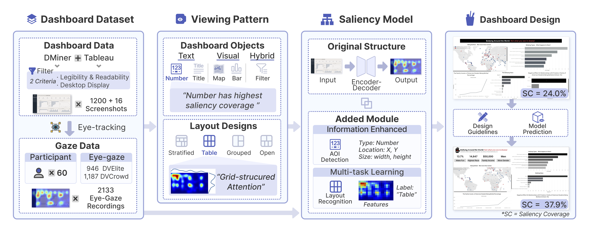

  <h1>Dashboard Vision: Using Eye-Tracking to Understand and Predict Dashboard Viewing Behaviors</h1>
  
  

    

      <a href="mailto:myang838@connect.hkust-gz.edu.cn">Manling Yang</a>1, 
      <a href="mailto:yhou073@connect.hkust-gz.edu.cn">Yihan Hou</a>1, 
      <a href="mailto:lli297@connect.hkust-gz.edu.cn">Ling Li</a>1, 
      <a href="mailto:remco.chang@tufts.edu">Remco Chang</a>3, 
      <a href="mailto:weizeng@hkust-gz.edu.cn">Wei Zeng</a>1, 2
    

    

      <strong>1</strong> Hong Kong University of Science and Technology (Guangzhou)  
      <strong>2</strong> Hong Kong University of Science and Technology  
      <strong>3</strong> Tufts University
    

  

  

    <a href="https://manlingyang123.github.io/Dashboard-Vision/" class="nav-button">Paper</a>
    <a href="https://osf.io/eyvda/" class="nav-button">Dataset & Code</a>
    <a href="assets/files/Supplemental Material.pdf" class="nav-button" download>Supplementary</a>
  

  

## Abstract

Dashboards serve as effective visualization tools for conveying complex information. However, there exists a knowledge gap regarding how dashboard designs impact user engagement, necessitating designers to rely on their design expertise. Saliency has been used to comprehend viewing behaviors and assess visualizations, yet existing saliency models are primarily designed for single-view visualizations. To address this, we conduct an eye-tracking study to quantify participants' viewing patterns on dashboards. We collect eye-movement data from 60 participants, each viewing 36 dashboards (16 representative dashboards shared by all and 20 unique dashboards), resulting in a total of 1,216 dashboards and 2,160 instances of eye-movement data. Analysis of the data from 16 dashboards viewed by all participants provides insights into how dashboard objects and layout designs influence viewing behaviors. Our analysis confirms known viewing patterns and reveals new patterns related to dashboard layout design. Using the eye-movement data and identified patterns, we develop a saliency model to predict viewing behaviors with dashboards. Compared to state-of-the-art models for single-view visualizations, our model demonstrates overall improvement in prediction performance for dashboards. Finally, we propose potential dashboard design guidelines, illustrate an application case and discuss general scanning strategies along with limitations and future work.
